# Auto Install Hadoop Cluster On Docker

## 前言：

一个Hadoop自动安装脚本，以5台KVM虚拟机和docker为基础，来自动步署Hadoop集群（HDFS、YARN、HBASE、HIVE、SPARK、HUE、Jupyter-notebook、Scope等）

##### 各组件版本

HDFS 3.1.1

YARN 3.1.1

HBASE 2.1.1

HIVE 3.1.1

SPARK 2.4.0

HUE 4.3.0

Jupyter-notebook 4.4.0

Scope 1.10.1  

Mysql：mariadb 10.3.11

Solr: 7.6.0

Livy: 0.5.0

OOZIE:  5.0.0

Myweb:  自编，服务索引与服务状态监控


## 架构与服务分配

| nn1                     | nn2                          | dn1         | dn2         | dn3         |
| ----------------------- | ---------------------------- | ----------- | ----------- | ----------- |
|                         |                              | zookeeper1  | zookeeper2  | zookeeper3  |
|                         |                              | JournalNode | JournalNode | JournalNode |
| NameNode                | NameNode                     | DataNode    | DataNode    | DataNode    |
| NodeManager             | NodeManager                  | NodeManager | NodeManager | NodeManager |
| ResourceManager         | ResourceManager              |             |             |             |
| HbaseMaster&Rest&Thrift | HiveMetadata&HiveServer2     | HbaseRegion | HbaseRegion | HbaseRegion |
|                         | SparkMaster                  | SparkWorker | SparkWorker | SparkWorker |
| YarnHistory&WebProxy    | SparkHistory&Livy&Solr&Oozie |             |             |             |
| Myweb                   | Hue&Mysql&Jupyter            |             |             |             |
| WeaveScope              | WeaveScope                   | WeaveScope  | WeaveScope  | WeaveScope  |

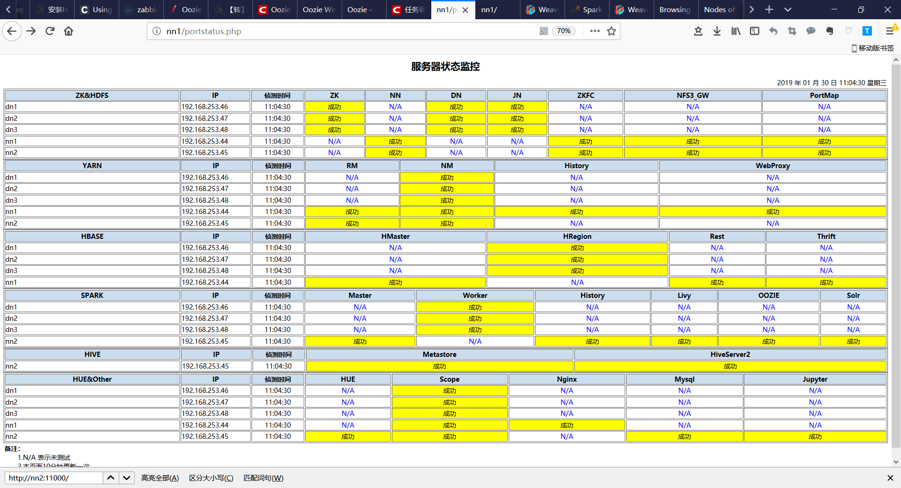


## 准备

- 克隆5台虚拟机，详见前篇**[基础架构十四：来试试把Centos7改造成Coreos]**，nn2需要调整到8G内存
- 下载所需docker镜相
  - [HadoopHA_Images.part1.rar]()   [HadoopHA_Images.part2.rar]() 包含9个安装用到的docker image, 解压到下一步clone的目录里
- 安装脚本工具  `git clone  https://github.com/Thomas-YangHT/hadoopHA-autoins.git`


## Step 1 配置

`cd hadoopHa-autoins; vim CONFIG` #修改5台机器的IP

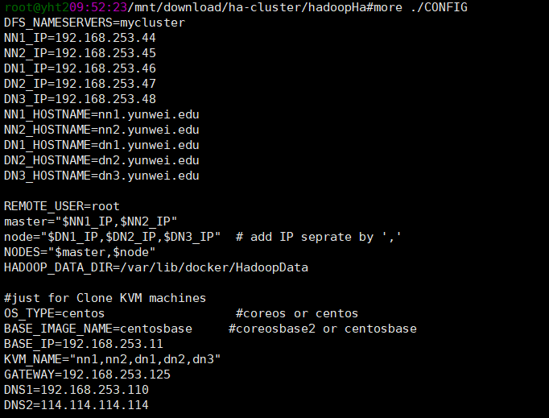


## Step 2 安装

`sh install all`  # 大约10分钟后完成安装

[](https://asciinema.org/a/5xpUiRhrALXiustmQcALlWQ06)

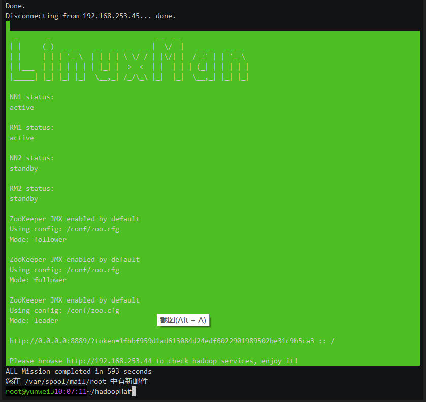


## Step 3 验证

打开安装完提示的链接：`http://<your nn1 IP>`

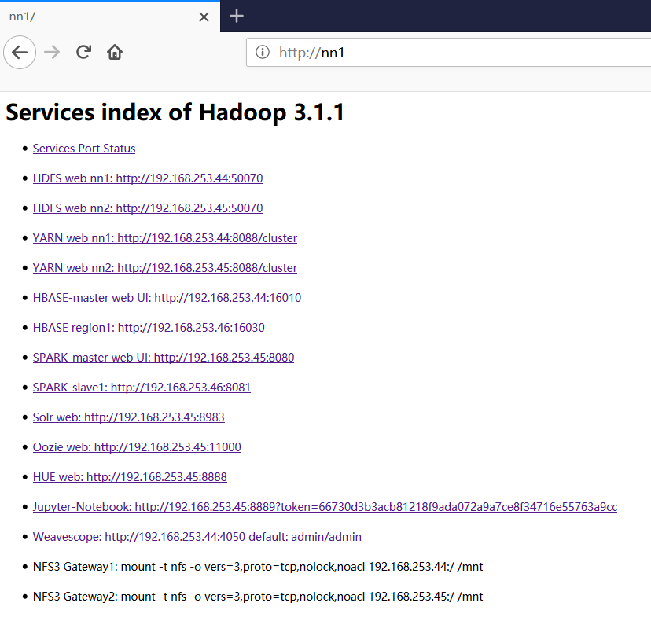
##### 服务端口状态


##### HDFS

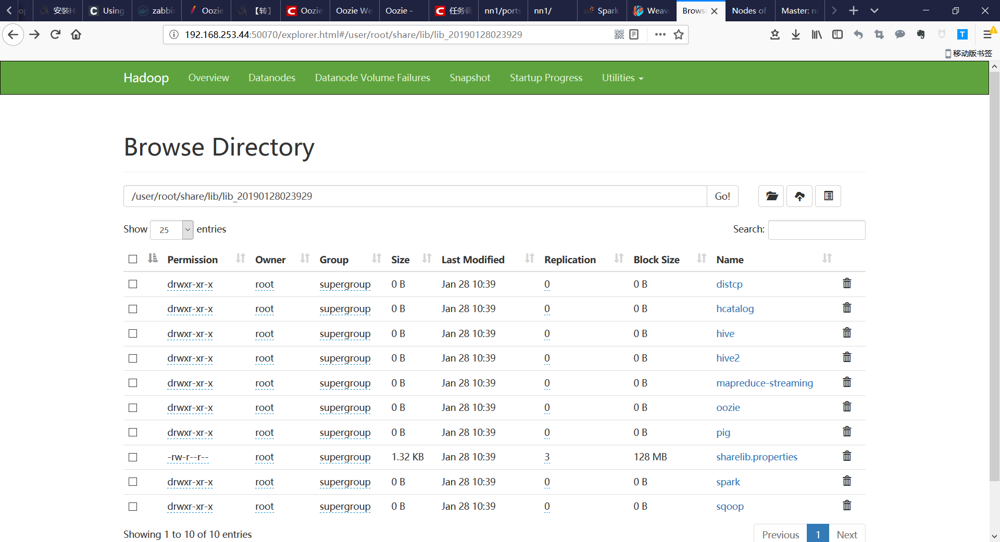


YARN

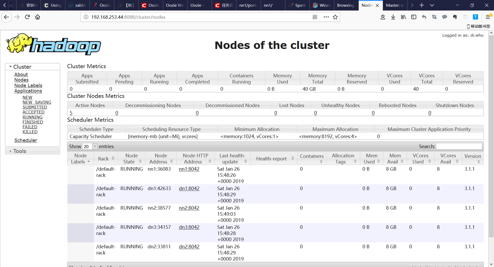

HBASE

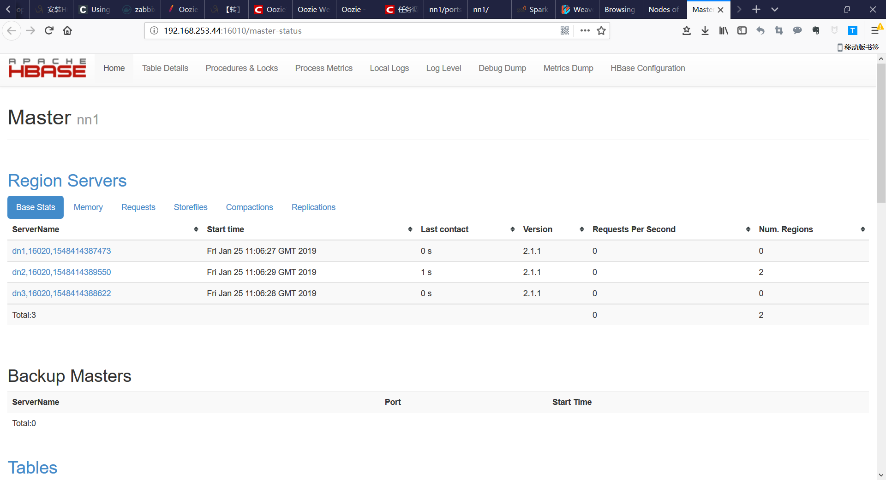

SPARK

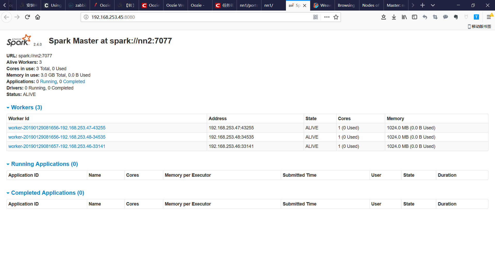

HUE

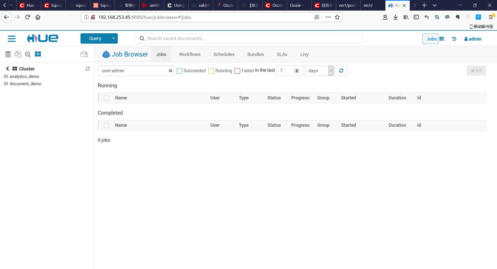

Solr

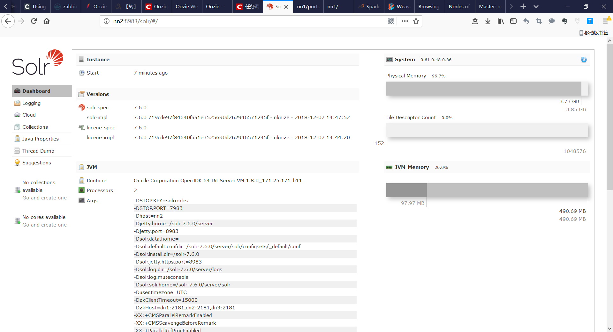

Oozie


Jupyter-notebook

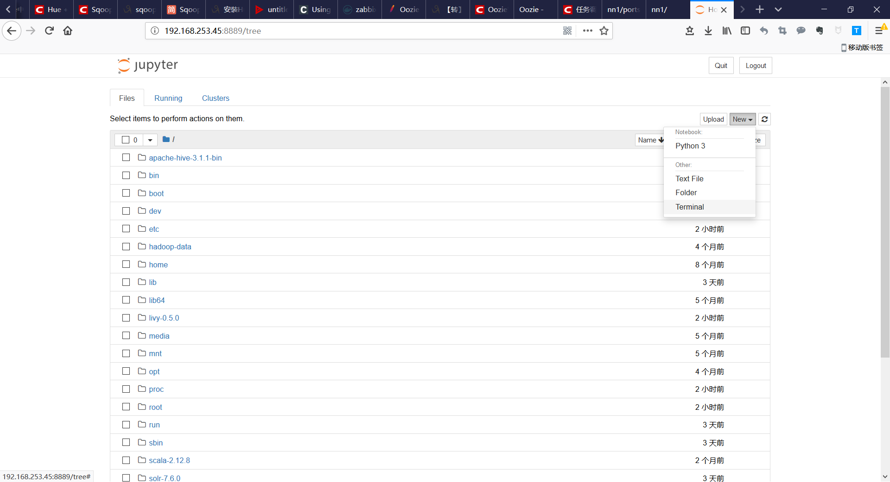

WeaveScope

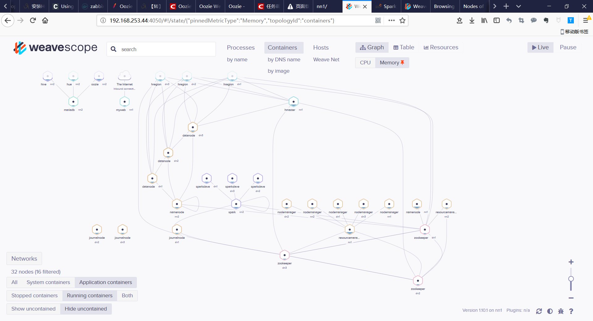

NFS
`mount -t nfs -o vers=3,proto=tcp,nolock,noacl <your nn1 ip>:/ /mnt`

## [LinuxMan]：Linux 命令搜索与资料书籍


```shell
  _       _                          __  __                 
 | |     (_)  _ __    _   _  __  __ |  \/  |   __ _   _ __  
 | |     | | | '_ \  | | | | \ \/ / | |\/| |  / _` | | '_ \ 
 | |___  | | | | | | | |_| |  >  <  | |  | | | (_| | | | | |
 |_____| |_| |_| |_|  \__,_| /_/\_\ |_|  |_|  \__,_| |_| |_|
```

